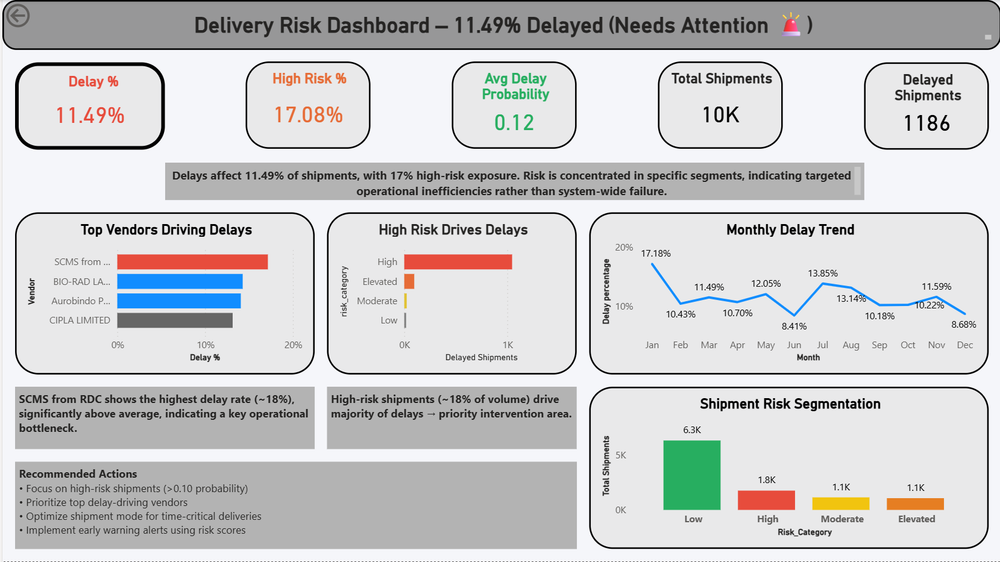
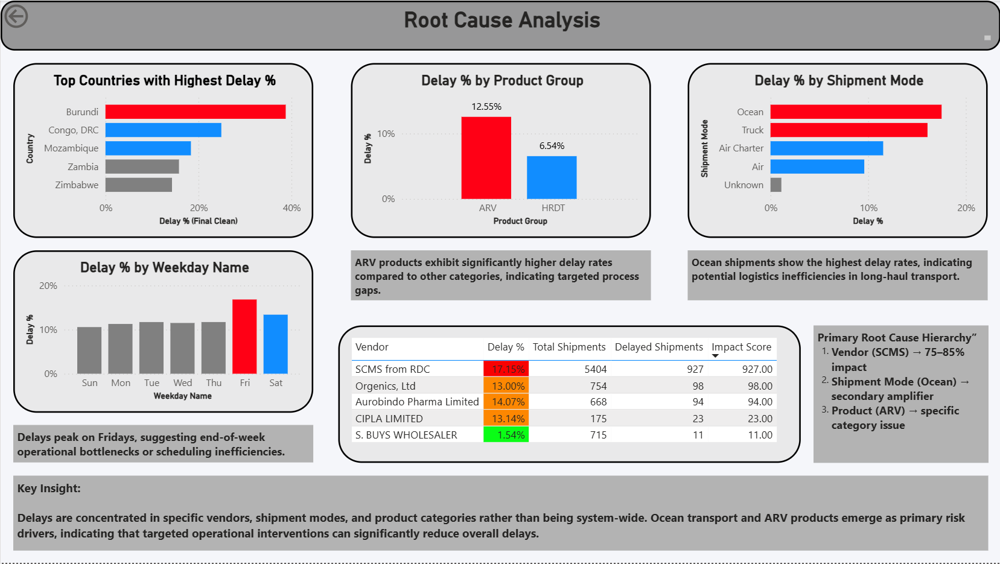
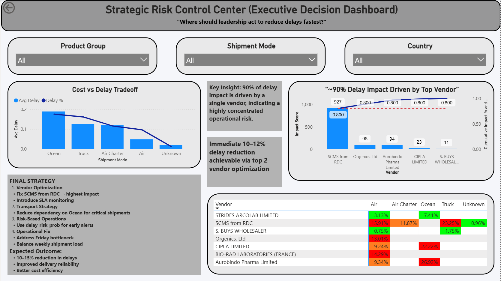

# 🚚 Logistics Delay Risk Prediction System

An end-to-end Machine Learning + Power BI solution to predict shipment delays, identify root causes, and enable proactive logistics decision-making.

> ⚠️ 11.49% shipments delayed | ~90% delay impact driven by a single vendor

---

## 📌 Overview

This project builds an end-to-end data analytics and machine learning pipeline to analyze shipment delays, identify key risk drivers, and predict high-risk deliveries. The final output is an executive Power BI dashboard designed for real-world logistics decision-making.

---

## 🎯 Objective

* Predict whether a shipment will be delayed
* Identify key drivers of delays (vendor, shipment mode, country, product)
* Enable risk-based prioritization using probability scores
* Provide actionable insights through a business dashboard

---

## 🧠 Solution Approach

### 1. Data Processing

* Cleaned and standardized shipment dataset
* Handled missing values and invalid records
* Converted date fields and ensured consistency
* Removed data leakage features

---

### 2. Feature Engineering

* Created delay metrics (`delay_days`, `delivery_time`)
* Built cost efficiency features (`cost_per_kg`)
* Extracted time-based features (month, weekday)
* Developed vendor performance scoring system

---

### 3. Modeling

Multiple models were evaluated:

* Logistic Regression
* Decision Tree
* Random Forest
* Gradient Boosting
* XGBoost

---

## 🔍 Model Selection & Threshold Optimization

### 📊 Model Comparison

Advanced models (Random Forest, XGBoost) were tested but showed:

* Overconfident predictions
* Poor probability calibration
* Instability in risk scoring

👉 Final model selected: **Logistic Regression**

### ✔️ Why Logistic Regression?

* Stable probability outputs
* Better interpretability
* More reliable for risk-based decision systems
* Generalizes better on this dataset

---

### ⚖️ Threshold Optimization

Instead of default threshold (0.5), multiple thresholds were tested.

* **Best threshold:** 0.69
* **Optimization metric:** F1 Score

---

### 📈 Trade-Off Analysis

At threshold = 0.69:

* ✅ Reduced missed delays (False Negatives ↓)
* ❌ Increased false alerts (False Positives ↑)

---

### 💼 Business Justification

In logistics operations:

* Missing a delayed shipment → **high business cost**
* False alert → **manageable operational cost**

👉 Therefore, model is optimized to:

**Prioritize recall over precision**

---

### 🎯 Final Decision

* Logistic Regression + threshold 0.69
* Balanced detection + business alignment
* Suitable for deployment in real-world systems

---

## 📊 Key Outputs

* **delay_risk_prob** → Probability of delay (0 to 1)
* **predicted_delay** → Binary classification
* **risk_category** → Low / Moderate / Elevated / High

---

## 📈 Dashboard Highlights

### 🔹 Delivery Risk Overview

* Delay % and High-Risk %
* Total shipments and delayed shipments
* Risk distribution

---

### 🔹 Root Cause Analysis

* Vendor-level delay contribution
* Shipment mode analysis (Ocean highest delay)
* Country-wise delay trends
* Product category insights

---

### 🔹 Strategic Insights

* ~90% delay impact driven by a single vendor
* Ocean shipments significantly increase delay risk
* Targeted vendor + transport optimization can reduce delays by ~10–12%

---

## 💼 Business Impact

This system acts as a **decision support tool**, enabling:

* Early identification of high-risk shipments
* Vendor performance monitoring
* Logistics optimization
* Reduction in delivery delays
* Data-driven operational decisions

---

## 🧾 Project Structure

```id="structfinal"
logistics-delay-risk-analysis/
│
├── notebook/        # ML model & preprocessing and cleaned dataset
├── data/            # original dataset
├── dashboard/       # Power BI dashboard
├── images/          # Dashboard screenshots
├── README.md
├── requirements.txt
```

---

## ⚙️ Tech Stack

* Python (Pandas, NumPy, Scikit-learn)
* Power BI
* Jupyter Notebook

---

## 📊 Dashboard Preview





---
## 🔥 Key Business Insights

- ~90% of delay impact is driven by a single vendor → high concentration risk
- Ocean shipments show highest delay rates → logistics inefficiency
- ARV product group has highest delay % → process bottleneck
- Delays peak on Fridays → scheduling inefficiency

---

## ⚠️ Key Trade-Off

The model prioritizes **recall over precision**:

* Captures most delays (low false negatives)
* Accepts some false alerts (manageable)

---

## 🚀 Final Conclusion

This project goes beyond a predictive model and delivers a:

👉 **Business-ready risk intelligence system**

It integrates:

* Data analysis
* Machine learning
* Business decision-making

to transform logistics operations from **reactive to proactive**.

---
## ⚠️ Model Limitation

The predicted probabilities show high concentration near 1.0, indicating potential calibration issues.

Future improvements:
- Probability calibration (Platt scaling / isotonic)
- Feature refinement to reduce bias
- More balanced training strategy

👉 Current model is effective for ranking risk, but probabilities should be interpreted cautiously
---

## 👤 Author

**Paras Dhawan**
